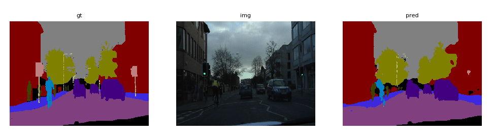

# SegNet
[SegNet](http://mi.eng.cam.ac.uk/projects/segnet/) implementation in Tensorflow.

## Environments
- Python 3.5.2
- Numpy==1.13.3
- Pillow==4.2.1
- tensorflow-gpu==1.3.0
- tensorflow-tensorboard==0.1.7


## Usage  
1. Download CamVid Dataset
```
bash download.sh
```

2. Convert CamVid dataset to TFRecord format
```
python camvid.py --target train
```

3. Training
```
python train.py \
  --iteration 20000 \
  --snapshot 4000 \
  --optimizer adadelta \
  --learning_rate 1.0
```

4. Evaluation
```
python eval.py \
  --resdir eval \
  --outdir output/camvid/segnet \
  --checkpoint_dir output/camvid/segnet/trained_model \
  --num_sample 233
```


## Results
<div align="center">

</div>


## Reference
- https://github.com/Pepslee/tensorflow-contrib
- https://github.com/warmspringwinds/tf-image-segmentation
- https://github.com/fabianbormann/Tensorflow-DeconvNet-Segmentation
- https://github.com/eragonruan/refinenet-image-segmentation
- https://github.com/DrSleep/tensorflow-deeplab-resnet
